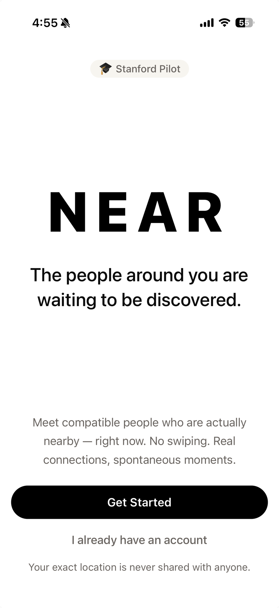
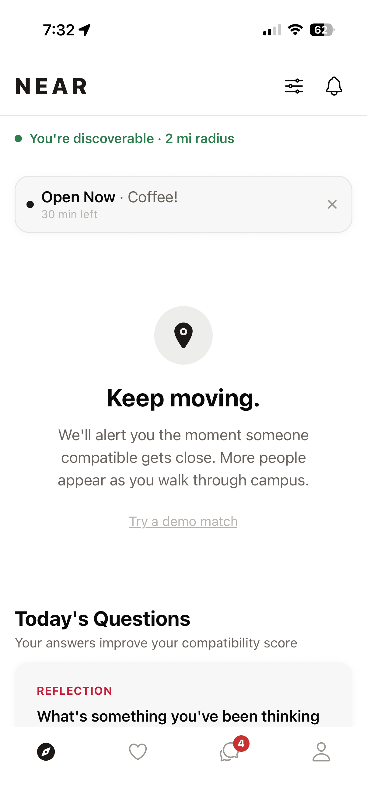

<p align="center">
  
</p>

# Near

**Proximity-based dating for Stanford students. No swiping. No pre-meeting chat. Just real people, in the same place, at the same time.**

Near detects when two compatible people are physically near each other on campus and opens a short window for both to say yes. If they match, they pick a spot nearby and actually show up — chat only unlocks once Near confirms they're both there.

Conducting a live pilot at Stanford.

---

<p align="center">
  
  &nbsp;&nbsp;
  
  &nbsp;&nbsp;
  
</p>

---

## How it works

```
You walk near someone compatible on campus
                ↓
Near opens a short window — both tap to match
                ↓
Pick a meeting spot nearby
                ↓
Head there
                ↓
Chat unlocks automatically once Near detects you're both there
```

No endless swiping. No texting strangers for weeks before meeting. The whole point is the meeting.

## Features

- **Real-time proximity matching** — no manual search, matches surface as you move through campus
- **Two-phase flow** — a short mutual-accept window, then a longer window to meet up in person
- **Curated on-campus meeting spots** with live location voting
- **Proximity-gated chat** — messaging only unlocks once both people are actually there
- **Compatibility scoring** from lifestyle tags, profile prompts, and daily personality questions
- **Safety & moderation** — Stanford `.edu` verification, automated photo screening, block/report tooling, and privacy-preserving location handling (exact coordinates are never exposed to other users)
- **Push notifications** for every key moment — new match, mutual match, meetup confirmed, chat unlocked
- **In-app currency (Sparks)** for extending windows, rescheduling, and reopening expired connections

## Tech stack

| Layer | Technology |
|---|---|
| Mobile | React Native + Expo, Expo Router |
| State | Zustand |
| Backend | Express.js on Node.js |
| Database | Cloud Firestore |
| Auth | Firebase Auth (Stanford `.edu` verified) |
| Storage | Firebase Storage |
| Push | Expo Push Notifications via EAS |
| Photo moderation | Google Cloud Vision SafeSearch |

---

## About the source

Near is live with real Stanford students' accounts, photos, locations, and conversations flowing through it in production — so the source stays private rather than public, to avoid exposing the internals of how user safety, moderation, and location privacy are enforced.

I'm glad to walk through the architecture and codebase directly — reach out via [leahbalakrishnan.com](https://leahbalakrishnan.com).
